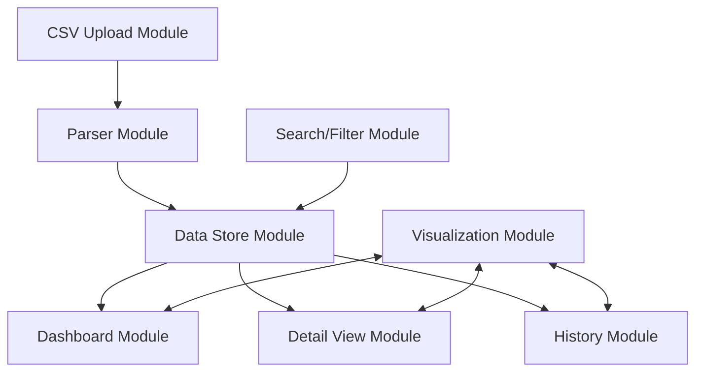

# System Patterns: Task Tracker Web App

## Architecture Overview

The Task Tracker follows a client-side single-page application architecture with modular components and browser-based storage:

## Core Design Patterns

### 1. Module Pattern
Each functional area is encapsulated in its own module with clear responsibilities:
- **FileHandler Module**: Handles file uploads and parsing (CSV & Excel)
- **Data Store Module**: Manages data persistence and retrieval
- **Dashboard Module**: Controls main view and summary displays
- **Detail Module**: Manages expanded views for specific items
- **History Module**: Tracks and visualizes temporal changes
- **Visualization Module**: Renders charts and tables
- **Search Module**: Processes queries and filters

### 2. Observer Pattern
- Components subscribe to data changes in the Data Store
- UI updates automatically when data changes
- Reduces tight coupling between modules

### 3. Strategy Pattern
- Interchangeable visualization strategies (chart vs table)
- Pluggable filter strategies
- Flexible data processing pipelines

### 4. Repository Pattern
- Abstracts data storage and retrieval
- Enables switching between storage mechanisms
- Handles data versioning and history

## Component Relationships

### Data Flow
1. User uploads CSV or Excel file
2. FileHandler detects file type and uses appropriate parser (PapaParse for CSV, SheetJS for Excel)
3. Data Store saves data with timestamp
4. Dashboard queries Data Store for summaries
5. Detail View queries for specific item details
6. History module compares versions of data
7. Search module queries across all data

### State Management
- Browser storage (IndexedDB) for persistence
- In-memory cache for performance
- Versioning mechanism for historical tracking

## Technical Decisions

### Client-Side Processing
- All processing happens in the browser
- No server dependencies
- Enables offline functionality

### Static Deployment
- Deployable to any static file hosting
- No backend requirements
- Single HTML entry point with bundled resources

### Responsive Design
- Mobile-first approach
- Flexible layouts that adapt to screen size
- Progressive enhancement for advanced features

### Browser Storage
- IndexedDB for structured data storage
- Local Storage for app settings and preferences
- Data versioning for historical comparison
